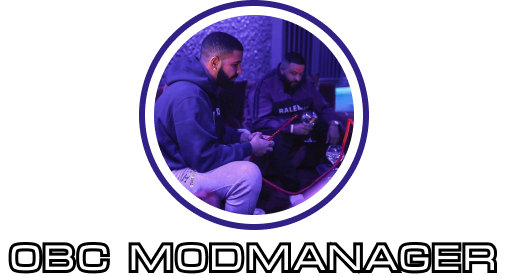

## Planned Features

- Active web-pages for all active OBC games, such as (ETS2, Lethal Company, Garry's Mod, etc...)
- Invite-system registration
- Mods suggestion system
- Fully-functional backend
- Auto-mods packer
- Desktop application (React.Native)
- Auto-announcements for OBC Discord
